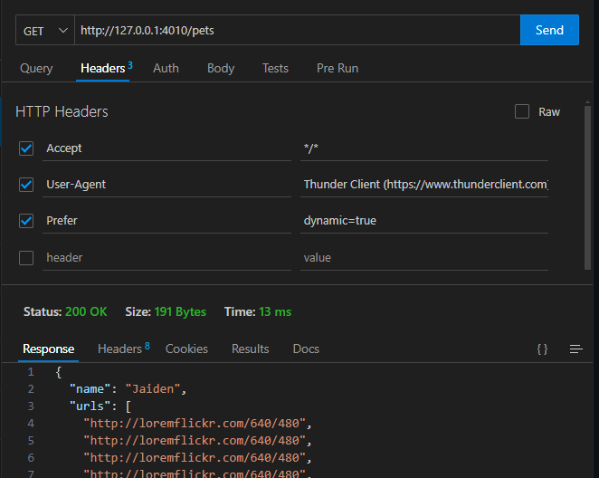

# Prism

**Prism** is a fantastic tool for mocking APIs based on OpenAPI specs.

Here's a very short exploratory post on how to get started with **Prism** to mock an API based on an OpenAPI specification.

---

### **Step-by-Step Guide to Setting Up Prism**

#### **1. Install Prism**

You can install **Prism** globally or as a local development dependency using npm.

**Install Prism globally:**

```bash
npm install -g @stoplight/prism-cli
```

**Or install it locally as a dev dependency:**

```bash
npm install --save-dev @stoplight/prism-cli
```

#### **2. Create An OpenAPI Specification**

Create a simple OpenAPI spec for the API. You can use JSON or YAML.

**Example `openapi.yml`:**

```yaml
openapi: 3.1.0
info:
  title: Simple API
  version: 1.0.0
paths:
  /greet:
    get:
      summary: Returns a greeting message
      responses:
        "200":
          description: A greeting message
          content:
            application/json:
              schema:
                type: object
                properties:
                  message:
                    type: string
                    example: "Hello, World!"
```

This specification describes a simple API with one endpoint, `/greet`, that returns a greeting message.

#### **3. Start Prism with the OpenAPI Specification**

Run Prism with your OpenAPI specification file. If you installed Prism globally, run the following command:

```bash
prism mock openapi.yml
```

If you installed it locally, use `npx` to run it:

```bash
npx @stoplight/prism-cli mock openapi.yml
```

Prism will now start a mock HTTP server at `http://localhost:4010` (by default) based on your OpenAPI spec.

#### **4. Test the Mock API**

Open a browser or use **curl** to test the mock API:

```bash
curl http://localhost:4010/greet
```

You should see the following response:

```json
{
  "message": "Hello, World!"
}
```

#### **5. Customizing the Mock Responses**

You can customize the responses by modifying the OpenAPI specification. For example, you can add query parameters, change response status codes, or use more complex response structures.

**A modified response with a query parameter**

```yaml
openapi: 3.1.0
info:
  title: Simple API
  version: 1.0.0
paths:
  /greet:
    get:
      summary: Returns a greeting message
      parameters:
        - in: query
          name: name
          required: false
          schema:
            type: string
            example: "John"
      responses:
        "200":
          description: A greeting message
          content:
            application/json:
              schema:
                type: object
                properties:
                  message:
                    type: string
                    example: "Hello, John!"
```

#### **6. Using Prism for Validation**

Prism also supports **request validation**, where it checks if the incoming requests conform to the OpenAPI specification. You can enable validation when running the mock server:

```bash
prism mock --validate openapi.yml
```

Now, if you send a request that doesn't match the specification (e.g., missing required parameters), Prism will respond with an error indicating the validation issue.

---

You now have a fully functional, mock API running with Prism, and you can easily test different API scenarios by modifying your OpenAPI specification. You can also scale this setup for more complex APIs and handle multiple routes, request validation, and more.

For more information see [the prism github page](https://github.com/stoplightio/prism).

---

## Dynamic Response Generation

When testing API calls, it's helpful to have dynamically generated responses to make sure your applications supports several use cases, instead of just testing with the same static piece of data over and over.

Prism uses the Faker and JSON Schema Faker libraries to help with that.

> Make sure you're running Prism in dynamic mode using the `-d` flag, or using the `Prefer` header with the `dynamic` key set to `true`.

---

### How It Works

In your OpenAPI description, you can pass in the `x-faker` keyword to a property, which allows for a specific Faker API method to be used.

If a user passes a method that doesn't exist, Prism falls back to using `JSON Schema Faker` to generate random values for that property. For example, if you ran

```bash
prism mock openapi.yml -d
```

And then issued a GET request to localhost:4010/greet you'd get back something like

```json
{
  "message": "est ut in"
}
```

### Using Typed Data

Here's how you can use the `name.firstName` and `image.imageUrl` Faker methods:

```yml
openapi: 3.1.0
info:
  title: Simple API
  version: 1.0.0
paths:
  /pets:
    get:
      summary: Returns a list of pets with photos
      responses:
        "200":
          description: A greeting message
          content:
            application/json:
              schema:
                type: object
                properties:
                  name:
                    type: string
                    x-faker: name.firstName
                    example: "Pluto"
                  urls:
                    type: array
                    items:
                      type: string
                      x-faker: image.imageUrl
```

You can now either start prism in dynamic mode:

```bash
prism mock openapifaker.yml -d
```

Or by passing the header with your GET request. eg



---

All the various supported methods can be found [here](https://docs.stoplight.io/docs/prism/9528b5a8272c0-dynamic-response-generation-with-faker#faker-supported-methods).

---

## Real World Example

I've included the AMP OpenAPI spec as a json file. To execute it and provide dynamic data run:

```bash
prism mock amp.json -d
```

This will start creating example endpoints for you with params (you don't have to use the examples, anything matching the route will work):


Everything requires an Authorization header. I did this with ThunderClient:


